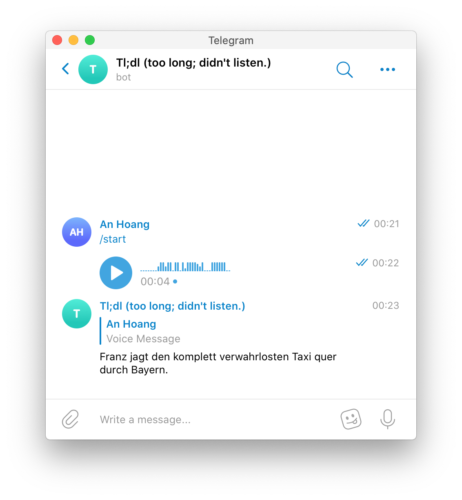

# Transcriber Bot 🤖

A telegram bot that automatically transcribes all voice messages.
Add this bot to your group chats to avoid listening to those unnecessarily long voice messages.
In order to run the bot follow the steps in the [Prerequisites](docs/Prerequisites.md).

## How it was build

This is a python 3 programm. 
It was built using the [python-telegram-bot](https://github.com/python-telegram-bot/python-telegram-bot) framework.
The voice is transcribed using [Amazon Transcribe](https://aws.amazon.com/transcribe/).
